# 생성형 AI 시대에서 인간 구조적 사고의 교육적 의미
## — 생성형 AI 언어 생성 구조와 카르노맵 시각적 패턴 해석 사례를 중심으로 —

---

## 초록

생성형 AI(Generative AI)는 대규모 언어 모델(LLM)을 기반으로 확률적으로 문장을 생성하며, 교육 분야에서 빠르게 활용 범위를 넓히고 있다. 그러나 생성형 AI의 언어 생성 능력은 인간의 사고 과정과 구조적으로 다르다. 인간은 단순히 확률적 패턴을 재현하는 것이 아니라, 경험과 의미를 기반으로 구조를 인식하고 재배열하며 새로운 의미를 발견하는 방식으로 사고한다.

본 연구는 생성형 AI의 언어 생성 구조와 인간 사고 과정의 특징을 비교·분석하고, 이 차이가 교육에서 어떤 의미를 가지는지 탐구한다. 또한 카르노맵(Karnaugh Map)의 시각적 패턴 해석 과정을 사례 연구로 제시하여, 인간이 실제로 어떻게 구조를 인식하고 재배열하는 방식으로 사고하는지를 보여준다. 특히 5.5절에서는 4변수 카르노맵 변수 배치의 동치류 이론을 수학적으로 전개하여, 독립 배치가 정확히 세 가지(AB/CD, AC/BD, AD/BC)로 한정되는 이유를 정사각형의 대칭군 D₄ 작용을 통해 엄밀히 증명한다.

연구 결과, 인간의 사고는 의미 이해, 자기반성(메타인지), 목적 의식 기반 창의성이라는 특징을 가지며, 생성형 AI의 확률 기반 생성과 본질적으로 다르다. 카르노맵의 시각적 패턴 해석 과정은 이러한 인간 구조적 사고의 실증 사례로 제시된다. 이에 따라 생성형 AI 시대의 교육은 단순 결과 획득이 아닌 사고 과정 중심, 메타인지 강화, AI 리터러시 교육 방향으로 발전해야 함을 제안한다.

---

## 1장 서론

### 1.1 연구 배경

최근 인공지능 기술은 빠른 속도로 발전하고 있으며, 특히 생성형 AI(Generative AI)의 등장은 사회 전반에 큰 변화를 일으키고 있다. 생성형 AI는 기존의 인공지능처럼 단순히 데이터를 분류하거나 예측하는 수준을 넘어, 사용자의 요청에 따라 새로운 텍스트, 이미지, 코드 등을 생성할 수 있다는 특징을 가진다. 대표적인 생성형 AI 서비스로는 OpenAI의 ChatGPT, Google의 Gemini, Anthropic의 Claude 등이 있으며, 이러한 기술은 교육·산업·문화 등 다양한 분야에서 빠르게 활용되고 있다.

교육 분야에서 생성형 AI의 활용은 매우 빠르게 증가하고 있다. 학생들은 생성형 AI를 활용하여 문제 풀이, 문서 요약, 프로그래밍 코드 생성, 개념 설명 등의 도움을 받을 수 있으며, 교사 역시 수업 자료 제작과 평가 문항 생성 등에 이를 활용하고 있다. 이처럼 생성형 AI는 학습 효율성과 정보 접근성을 높이는 새로운 도구로 주목받고 있다.

그러나 생성형 AI의 발전은 단순한 기술적 편의성 이상의 질문을 함께 제기하고 있다. 생성형 AI는 인간과 유사한 문장을 자연스럽게 생성할 수 있지만, 실제로 인간처럼 의미를 이해하거나 사고 과정을 경험하는 것은 아니다. 생성형 AI는 방대한 데이터 속 언어 패턴을 학습하여 확률적으로 다음 단어를 예측하는 방식으로 동작하며, 이는 인간의 사고 구조와 본질적으로 다른 특징을 가진다.

반면 인간은 단순히 정보를 조합하는 것이 아니라, 경험과 기억, 감정, 목적 의식 등을 기반으로 사고 과정을 거친다. 인간의 사고 과정에는 의미 이해, 자기반성, 논리적 추론과 같은 복합적인 인지 활동이 포함된다. 특히 인간은 구조를 인식하고 재배열하며 새로운 의미를 발견하는 방식으로 사고하는데, 이는 생성형 AI의 패턴 기반 생성과 근본적으로 다른 특징이다.

### 1.2 문제 제기

본 연구는 다음과 같은 핵심 질문을 중심으로 탐구한다.

첫째, 인간의 사고 과정과 생성형 AI의 생성 과정은 구조적으로 어떠한 차이를 가지는가?

둘째, 생성형 AI는 왜 의미를 이해하지 못하면서도 인간과 유사한 결과를 생성할 수 있는가?

셋째, 카르노맵의 시각적 패턴 해석 과정은 어떻게 인간의 구조적 사고를 보여주는 사례가 될 수 있는가?

넷째, 생성형 AI 시대의 교육은 어떠한 방향으로 변화해야 하는가?

### 1.3 연구 목적

본 연구의 목적은 생성형 AI의 언어 생성 구조와 인간 사고 구조를 비교·분석하고, 카르노맵 시각적 패턴 해석을 실증 사례로 제시하여 인간 구조적 사고의 교육적 의미를 탐구하는 데 있다.

궁극적으로 본 연구는 생성형 AI 시대에서 인간 사고 과정의 중요성을 재조명하고, 사고 과정 중심 교육이 왜 대체 불가능한지를 분석하며, 미래 교육이 어떠한 방향으로 발전해야 하는지에 대한 시사점을 제시하고자 한다.

### 1.4 논문 구성

본 논문은 다음과 같이 구성된다. 2장에서는 생성형 AI의 구조와 동작 원리를 분석한다. 3장에서는 인간 사고 과정의 특징을 탐구한다. 4장에서는 두 구조의 차이를 비교 분석하고 사례를 제시한다. 5장에서는 카르노맵 시각적 패턴 해석을 인간 구조적 사고의 실증 사례로 분석한다. 특히 5.5절에서는 4변수 카르노맵 변수 배치의 동치류 이론을 수학적으로 전개하여, 독립 배치가 세 가지로 한정되는 이유를 엄밀히 증명한다. 6장에서는 생성형 AI의 교육 활용과 한계를 정리한다. 7장에서는 생성형 AI 시대의 교육 방향을 제안한다. 8장에서 결론을 맺는다.

---

## 2장 생성형 AI의 구조와 동작 원리

### 2.1 생성형 AI의 개념

생성형 AI(Generative AI)는 사용자의 입력을 바탕으로 새로운 결과물을 생성하는 인공지능 기술을 의미한다. 기존의 인공지능이 데이터 분류나 예측 중심으로 동작하였다면, 생성형 AI는 텍스트, 이미지, 음성, 코드 등의 새로운 콘텐츠를 직접 생성할 수 있다는 특징을 가진다.

기존 검색 엔진이 사용자가 원하는 정보를 웹페이지 형태로 제공하는 데 초점이 맞춰져 있었다면, 생성형 AI는 여러 정보를 종합하여 하나의 응답 형태로 재구성한다. 이로 인해 사용자는 보다 빠르고 직관적으로 정보를 얻을 수 있지만, 동시에 정보 출처가 불명확해질 가능성도 존재한다.

### 2.2 동작 원리: 확률 기반 언어 생성

생성형 AI는 대규모 언어 모델(LLM, Large Language Model)을 기반으로 동작한다. 대규모 언어 모델은 인터넷 문서, 책, 논문 등 방대한 양의 텍스트 데이터를 학습하여 언어 패턴을 분석한다.

생성형 AI의 핵심 원리는 "다음에 올 가능성이 가장 높은 단어를 예측하는 것"에 있다. 사용자가 특정 문장을 입력하면, AI는 이전 단어들과 문맥을 분석하여 다음에 등장할 확률이 높은 단어를 계산한다. 이러한 과정이 반복되면서 하나의 문장이 생성된다.

생성형 AI는 주로 딥러닝(Deep Learning) 기반의 트랜스포머(Transformer) 구조를 사용한다. 트랜스포머 구조는 문장 내 단어 간 관계를 효율적으로 분석할 수 있으며, Self-Attention 메커니즘은 문장 속 각 단어가 다른 단어와 어떤 관계를 가지는지를 계산하여 자연스러운 문장 생성에 기여한다.

생성형 AI의 응답 생성 과정은 기본적으로 확률 계산 과정에 가깝다. AI는 문장의 의미를 인간처럼 이해한다기보다, 학습된 데이터 속 패턴을 기반으로 가장 자연스러워 보이는 결과를 생성한다.

### 2.3 생성형 AI의 한계: 환각 현상

생성형 AI의 가장 중요한 한계 중 하나는 환각(Hallucination) 현상이다. 환각 현상이란 생성형 AI가 사실과 다른 정보를 자연스럽게 생성하는 현상을 의미한다.

예를 들어 존재하지 않는 논문을 실제 논문처럼 설명하거나, 잘못된 역사 정보나 허위 통계를 자연스러운 문장으로 제시하는 경우가 발생할 수 있다. 이러한 현상은 생성형 AI가 실제 사실 여부를 이해하거나 검증하는 구조가 아니라, 언어 패턴의 자연스러움을 우선적으로 계산하기 때문에 발생한다.

이는 교육 분야에서 특히 중요한 문제로, 학습자가 AI가 제공하는 정보를 무비판적으로 수용할 경우 잘못된 지식을 학습하게 만들 수 있다는 위험성을 가진다.

---

## 3장 인간 사고 과정의 특징

### 3.1 의미 이해와 경험 기반 사고

사고(Thinking)란 인간이 정보를 해석하고 연결하며 판단을 내리는 인지 과정이다. 인간은 외부로부터 얻은 정보를 단순히 저장하는 것이 아니라, 기존의 경험과 기억, 감정, 가치관 등을 바탕으로 의미를 부여하고 새로운 결론을 도출한다.

특히 인간은 언어를 단순 기호가 아닌 "의미"를 가진 대상으로 인식한다. 같은 문장이라도 상황과 맥락에 따라 다르게 해석할 수 있으며, 감정이나 사회적 관계 역시 이해 과정에 영향을 미친다. 예를 들어 "차가 춥다"라는 표현은 상황에 따라 자동차 혹은 음료를 가리킬 수 있으며, 인간은 맥락을 고려하여 자연스럽게 의미를 판단한다.

인간의 사고 과정은 다양한 인지 요소들이 상호작용하며 이루어진다. 과거 경험은 새로운 상황을 이해하는 기준이 되며, 기억 속 정보들은 서로 연결되어 새로운 의미를 형성한다. 또한 인간은 원인과 결과를 연결하거나 여러 정보를 비교·분석하며 결론을 도출하는 논리적 추론 과정을 수행한다.

### 3.2 메타인지: 자신의 사고를 다시 사고하는 능력

인간 사고의 가장 중요한 특징 중 하나는 자신의 사고 과정을 인식하고 조절할 수 있다는 점이다. 이러한 능력은 메타인지(Metacognition)라고 불린다.

메타인지는 다음 세 가지 능력을 포함한다:

- 자기 인식(Self-Awareness): 자신의 판단이 어떻게 형성되는지 알 수 있음
- 자기 수정(Self-Correction): 잘못된 사고 방식을 스스로 바꿀 수 있음
- 자기 반성(Self-Reflection): 과거 판단의 오류를 돌아볼 수 있음

메타인지는 학습과 문제 해결 과정에서 핵심적인 역할을 수행한다. 학습자는 자신이 무엇을 알고 무엇을 모르는지를 판단하고, 그에 따라 학습 방향을 스스로 조정할 수 있다. 인간의 사고 과정은 단순 계산이나 정보 조합이 아니라, 바로 이 메타인지 능력을 통해 끊임없이 자기 수정과 발전이 이루어진다.

생성형 AI는 이 능력을 가지지 않는다. AI의 "수정"은 외부 피드백이나 추가 학습 데이터에 의존한다는 점에서, 내부에서 자기 반성을 수행하는 인간 사고 구조와 근본적으로 다르다.

### 3.3 목적 의식 기반 창의성

창의성 역시 인간 사고의 중요한 특징이다. 인간의 창의성은 단순한 정보 재조합이 아니라 경험, 감정, 목적 의식 등을 바탕으로 새로운 의미와 가치를 만들어내는 과정이다.

인간은 자신의 삶의 경험이나 사회적 문제의식 속에서 새로운 아이디어를 떠올릴 수 있으며, 왜 이러한 아이디어가 필요한지에 대한 목적 의식을 가진다. 인간의 창의성은 단순 결과 생성이 아니라 "의미 있는 창조"와 연결되어 있다.

---

## 4장 인간 사고와 생성형 AI의 구조적 차이

### 4.1 언어 생성 능력 ≠ 인간적 이해 능력

철학자 존 설(John Searle)은 1980년 '중국어 방 논증(Chinese Room Argument)'을 통해, 규칙 기반 기호 처리가 실제 의미 이해와 동일하지 않음을 주장하였다. 방 안의 사람은 중국어를 전혀 모르더라도 규칙집을 따라 중국어 질문에 적절한 답변을 내놓을 수 있다. 그러나 이 사람이 중국어를 "이해"한다고 말할 수는 없다. 이 논증은 오늘날 생성형 AI의 언어 생성 구조를 이해하는 데에도 유효한 관점을 제공한다.

생성형 AI는 방대한 데이터에서 학습된 언어 패턴을 기반으로 자연스러운 문장을 생성한다. 그러나 이 과정에서 AI가 문장의 의미를 이해한다고 보기는 어렵다. AI의 응답은 "다음에 올 가능성이 가장 높은 단어"를 반복적으로 선택하는 계산 과정에 가깝다.

인간은 의미를 기반으로 사고하지만, 생성형 AI는 패턴을 기반으로 생성한다는 차이가 존재한다.

### 4.2 구조적 차이 비교

아래 표는 인간 사고와 생성형 AI의 구조적 차이를 정리한 것이다.

| 구분       | 인간 사고              | 생성형 AI              | 교육적 시사점                              |
|------------|----------------------|----------------------|-------------------------------------------|
| 기반       | 경험·감정·목적 의식    | 데이터 패턴            | AI 의존 시 경험 기반 사고 형성 기회 감소   |
| 의미 이해  | 가능                  | 제한적 (통계적)        | AI 의존 시 의미 구성 능력 약화 가능        |
| 오류 원인  | 편향·감정·경험 왜곡   | 환각·패턴 오류         | AI 응답의 비판적 검토 능력 교육 필요       |
| 자기반성   | 가능 (메타인지)       | 불가능                 | AI 의존 시 메타인지 형성 기회 감소         |
| 창의성     | 목적 기반 창조        | 패턴 재구성            | AI 의존 시 목적 의식 기반 창조력 약화      |
| 오류 인식  | 스스로 가능           | 외부 피드백 필요       | AI 의존 시 비판적 검토 능력 형성 기회 감소 |

### 4.3 사례 분석

**사례 1: 환각(Hallucination) 현상**

연구자가 생성형 AI에 특정 주제의 논문 목록을 요청하였을 때, AI는 매우 자연스러운 형식으로 존재하지 않는 논문들을 실제 논문처럼 나열하였다. 저자명, 발행 연도, 저널명까지 구체적으로 포함되어 있었지만, 실제 검색에서는 해당 논문을 찾을 수 없었다.

이 사례는 "언어적 자연스러움"과 "사실적 이해"가 별개의 능력임을 보여준다. 생성형 AI는 논문 목록이 어떤 형식이어야 하는지를 학습하여 그 패턴을 재현하였지만, 실제 논문의 존재 여부를 이해하거나 검증하지는 않았다.

**사례 2: 수학 문제 풀이 과정 비교**

동일한 수학 문제를 인간 학습자와 생성형 AI에 제시한 경우를 비교하면 다음과 같다.

인간 학습자:
- 문제 조건을 읽고 의미를 이해
- 어떤 공식을 적용할지 고민
- 중간 과정에서 오류 발견 시 스스로 수정
- 풀이 결과를 다시 확인하고 타당성 검토

생성형 AI:
- 패턴 기반으로 풀이 형식을 생성
- 중간 추론 과정에서 논리적 오류가 발생하더라도 자연스러운 문장으로 제시
- 자신의 풀이가 잘못되었음을 스스로 인식하지 못함

인간의 풀이 과정에는 사고 과정 자체가 존재하며, 이 과정에서 논리적 추론 능력과 문제 해결 능력이 형성된다. 반면 생성형 AI의 과정은 패턴 기반 생성에 가깝다.

### 4.4 오류 발생 방식의 차이

인간과 생성형 AI는 모두 오류를 발생시킬 수 있지만, 오류가 발생하는 원인과 구조에는 차이가 존재한다.

인간의 오류는 주로 경험 부족, 편향, 감정적 판단, 기억 왜곡 등에서 발생한다. 중요한 것은 인간은 자신의 오류를 인식하고 수정하려는 자기반성 능력을 가진다는 점이다.

반면 생성형 AI의 오류는 주로 데이터 패턴 기반 생성 구조에서 발생한다. 생성형 AI는 스스로 자신의 답변이 잘못되었음을 인식하지 못하며, 수정 과정은 외부 피드백이나 추가 학습 데이터에 의존한다.

---

## 5장 사례 연구: 카르노맵 시각적 패턴 해석

### 5.1 인간 구조적 사고와의 연결

앞서 3장에서 인간은 의미를 이해하고 구조를 인식하며 재배열하는 방식으로 사고한다고 설명하였다. 이러한 주장은 추상적 논의에 그칠 수 있다. 본 장에서는 카르노맵의 시각적 패턴 해석 과정을 통해, 인간이 실제로 어떻게 구조를 인식하고 재배열하며 의미를 발견하는지를 보여주고자 한다.

카르노맵에서 인간이 단순히 알고리즘을 따르는 것이 아니라 대칭성을 탐색하고, 패턴을 인식하며, 변수를 재배열하여 구조를 이해하는 과정은 바로 3장에서 설명한 "구조를 인식하고 재배열하며 의미를 발견하는 인간 사고"의 살아있는 예시이다.

### 5.2 카르노맵 기존 방식의 한계

카르노맵(Karnaugh Map)은 논리회로에서 Boolean 함수를 시각적으로 단순화하기 위해 사용되는 대표적인 도구이다. 기존의 카르노맵 해석은 인접한 항들을 그룹화하여 SOP(Sum of Products) 또는 POS(Product of Sums) 형태의 최소 논리식을 구하는 방식으로 활용된다.

그러나 기존 방식은 주로 직사각형 그룹 기반 최소화에 집중되어 있으며, XOR/XNOR과 같은 일부 구조는 일반적인 인접 그룹만으로 직관적으로 설명하기 어려운 경우가 존재한다.

예를 들어, 직사각형 그룹 최소화 기법을 적용할 때 인접 관계만을 고려하면 다음과 같이 흩어진 형태의 패턴이 생성되지만, 실제로는 XOR/XNOR 계열의 체커보드 구조를 나타낸다.

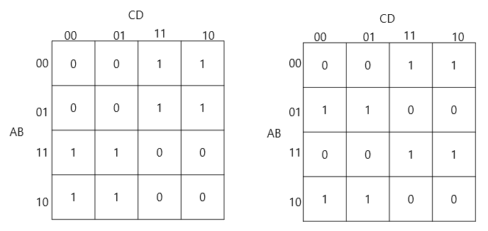

그림 5.1: XOR/XNOR 계열의 인접하지 않은 1들의 배치 예시

이러한 함수는 일반적인 인접 그룹 기반 최소화만으로는 직관적인 구조 파악이 어렵지만, 시각적 대칭성과 반복 패턴을 인지하면 더욱 쉽게 구조를 이해할 수 있다.

특히 인간은 단순 계산 결과를 얻는 것보다, 반복성, 대칭성, 균형감과 같은 시각적 특징을 통해 구조를 이해하려는 경향을 가진다. 따라서 카르노맵 또한 단순 최소화 도구가 아니라 인간의 시각적 패턴 인식과 구조적 이해 과정이 반영된 공간으로 해석할 수 있다.

### 5.3 NAND/NOR 게이트의 카르노맵 해석 및 범용성

카르노맵은 단순 최소화뿐만 아니라 범용 게이트(Universal Gate)인 NAND와 NOR 게이트를 활용한 변환 및 설계에도 유용하게 활용된다. 카르노맵에서 출력값 '0'을 그룹화하여 부정하는 방식으로 NAND 또는 NOR 형태의 논리식을 얻을 수 있다.

- **NAND 게이트 변환**: 카르노맵의 대부분이 '1'로 채워지고 특정 구석만 '0'일 때, '0'이 적힌 셀에 주목하여 논리식을 구한 뒤 전체 부정을 취하는 방식으로 NAND 구성을 해석한다.
  
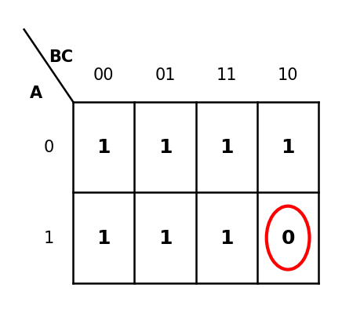
  
그림 5.2: NAND 게이트 기반 카르노맵 해석 예시 (F = (A·B·C̄)‾)

- **NOR 게이트 변환**: 카르노맵의 대부분이 '0'이고 특정 부분만 '1'일 때, '1'이 적힌 셀의 논리식에 전체 부정을 취하거나 '0'을 POS 형태로 묶어 NOR 게이트로 표현한다.
  

  
그림 5.3: NOR 게이트 기반 카르노맵 해석 예시 (F = (A+B+C+D)‾)

또한, NAND와 NOR 게이트의 완전성(functional completeness)을 이용해 XOR 회로를 각각 NAND-only 또는 NOR-only 회로로 구현할 수 있으며, 이는 드모르간 법칙에 의해 아래와 같이 표현된다.

- **NAND-only XOR 구현**:
  $F = A \oplus B = (A \text{ NAND } (A \text{ NAND } B)) \text{ NAND } (B \text{ NAND } (A \text{ NAND } B))$
  
  | A | B | A NAND B | A NAND (A NAND B) | B NAND (A NAND B) | A XOR B |
  |---|---|:---:|:---:|:---:|:---:|
  | 0 | 0 | 1 | 1 | 1 | 0 |
  | 0 | 1 | 1 | 1 | 0 | 1 |
  | 1 | 0 | 1 | 0 | 1 | 1 |
  | 1 | 1 | 0 | 1 | 1 | 0 |
  

- **NOR-only XOR 구현**:
  $F = A \oplus B = (A \text{ NOR } B) \text{ NOR } ((A \text{ NOR } A) \text{ NOR } (B \text{ NOR } B))$

  | A | B | A NOR B | A AND B | A XOR B |
  |---|---|:---:|:---:|:---:|
  | 0 | 0 | 1 | 0 | 0 |
  | 0 | 1 | 0 | 0 | 1 |
  | 1 | 0 | 0 | 0 | 1 |
  | 1 | 1 | 0 | 1 | 0 |

### 5.4 범용 게이트의 존재성에 관한 증명

AND만으로 만든 모든 회로는 $f(0,\dots,0)=0$이지만 NOT은 $\text{NOT}(0)=1$이다. 따라서 AND만으로는 NOT 생성이 불가능하다.
OR만으로 만든 모든 회로는 $f(1,1,\dots,1)=1$이지만 $\text{NOT}(1)=0$이다. 따라서 OR만으로는 NOT 생성이 불가능하다.
XOR만으로 만든 모든 회로는 $f(0,\dots,0)=0 \oplus 0=0$이지만 $\text{NOT}(0)=1$이다.

이처럼 NAND와 NOR는 단조성(monotonicity), 0보존성, 1보존성 등을 깨버릴 수 있어서 완전성(functional completeness)이 생기며 범용 게이트로 활용될 수 있다.

### 5.5 변수 배치의 수학적 분류: 동치류 이론

앞 절에서 NAND/NOR 게이트의 범용성을 확인하였다. 본 절에서는 4변수 카르노맵에서 변수 배치를 체계적으로 분류하기 위한 수학적 기반을 제시한다. 이를 통해 독립적인 변수 배치가 정확히 세 가지임을 엄밀하게 증명하고, 이후 체커보드 패턴 분석 및 변수 재배열 해석의 이론적 근거를 마련한다.

#### 5.5.1 좌표계 및 표기법

본 연구에서는 4변수 카르노맵의 변수 배치 구조를 분석하기 위하여 좌표계와 표기법을 다음과 같이 정의한다.

카르노맵의 각 셀 위치는 (행, 열) 형태로 표기한다. 행 번호와 열 번호는 모두 좌측 상단을 기준으로 하며, 행 번호는 위에서 아래 방향으로, 열 번호는 왼쪽에서 오른쪽 방향으로 증가한다. 따라서 행과 열의 인덱스는 각각 1, 2, 3, 4의 순서로 부여된다.

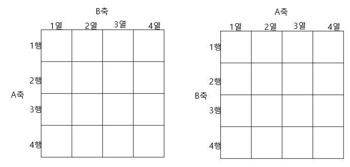
그림 5.5.1: 4×4 카르노맵 좌표계 — 행 번호는 위에서 아래로 1에서 4, 열 번호는 왼쪽에서 오른쪽으로 1에서 4

한편 카르노맵의 변수 배열은 일반적인 이진수 순서가 아닌 그레이코드(Gray Code) 순서를 사용한다. 2변수 그레이코드의 배열 순서는 다음과 같다.

$$00,\ 01,\ 11,\ 10$$

본 연구에서는 계산 및 대칭성 분석의 편의를 위하여 위의 그레이코드 순서에 대응하는 인덱스를 다음과 같이 정의한다.

$$00 \rightarrow 0,\quad 01 \rightarrow 1,\quad 11 \rightarrow 3,\quad 10 \rightarrow 2$$

따라서 카르노맵의 행 또는 열에 사용되는 그레이코드 인덱스 순서는 $0,\ 1,\ 3,\ 2$로 표현된다.

이후 변수 순서 교환을 분석하는 과정에서 그레이코드의 비트 순서를 반대로 읽는 경우가 발생한다. 예를 들어 변수 순서가 XY에서 YX로, 또는 ZW에서 WZ로 변경될 경우 기존의 그레이코드 순서 $0, 1, 3, 2$는 $0, 2, 3, 1$로 변환된다.

  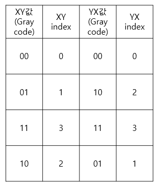

또한 카르노맵의 좌우 경계와 상하 경계는 서로 연결되어 있다고 가정한다. 따라서 행 또는 열 전체를 일정한 간격만큼 이동시키는 순환 이동(cyclic shift)은 카르노맵의 인접 관계를 유지하는 구조 보존 변환으로 취급한다. 이 가정은 이후 변수 순서 교환과 대칭성 분석의 기본 전제로 사용된다.

아래 표는 순환 이동의 예를 보여준다. 그레이코드 인덱스 순서 $[0, 1, 3, 2]$를 한 칸 이동하면 $[1, 3, 2, 0]$이 되며, 카르노맵의 상하·좌우 경계가 연결되어 있으므로 이 변환은 인접 관계를 보존한다.

  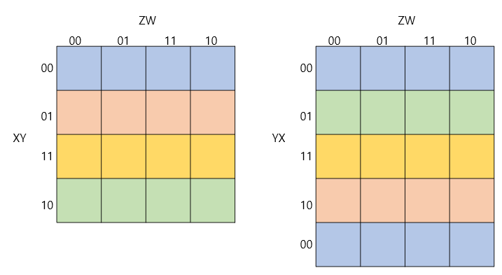

  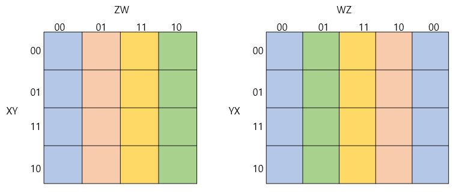

#### 5.5.2 변수 순서 교환과 거울 대칭성

본 절에서는 변수 집합은 유지한 채 변수의 순서만 변경하는 경우를 분석한다. 변수 순서의 변화는 카르노맵의 형태를 변화시키는 것처럼 보이지만, 실제로는 거울 대칭과 순환 이동을 통하여 동일한 구조로 해석될 수 있음을 보인다.

**정리 1. 행 변수 순서 교환**

변수 배치가 XY/ZW일 때 행 변수의 순서를 교환한 YX/ZW는 원래 카르노맵과 동치이다.

$$XY/ZW \equiv YX/ZW$$

증명에 앞서 2변수 그레이코드의 순서를 살펴보자. 원래의 그레이코드 인덱스 순서는 $0, 1, 3, 2$이다.

행 변수의 순서를 XY에서 YX로 변경하면 각 비트의 위치가 교환되므로 인덱스 순서는

$$0, 1, 3, 2 \rightarrow 0, 2, 3, 1$$

로 변환된다.

아래 표는 XY/ZW 배치와 YX/ZW 배치의 행 순서를 비교한 것이다.

위 결과에서 YX/ZW 배치의 행 순서 $[0, 2, 3, 1]$은 XY/ZW 배치의 행 순서 $[0, 1, 3, 2]$를 상하로 반사한 것에 해당한다. 구체적으로, 인덱스 1과 2의 위치가 서로 교환되며, 이는 카르노맵에서 2행과 4행의 순서가 뒤바뀌는 것과 동일하다.

이 변환은 카르노맵의 상하 반사(vertical reflection)에 해당하며, 카르노맵의 상하 경계가 연결되어 있으므로 순환 이동을 고려하면 원래 배열과 동일한 인접 관계를 유지한다. 따라서 행 변수 순서 교환은 카르노맵의 구조를 변화시키지 않으며, $XY/ZW \equiv YX/ZW$가 성립한다.

  

**정리 2. 열 변수 순서 교환**

변수 배치가 XY/ZW일 때 열 변수의 순서를 교환한 XY/WZ는 원래 카르노맵과 동치이다.

$$XY/ZW \equiv XY/WZ$$

열 변수의 순서를 ZW에서 WZ로 변경하면 각 비트의 위치가 교환되므로 그레이코드 인덱스 순서는

$$0, 1, 3, 2 \rightarrow 0, 2, 3, 1$$

로 변환된다.

여기에 카르노맵의 순환 이동을 적용하면 $0, 2, 3, 1 \rightarrow 2, 3, 1, 0$을 얻는다. 한편 원래의 그레이코드 인덱스 $0, 1, 3, 2$를 역순으로 배열하면 $2, 3, 1, 0$이 된다.

아래 표는 이 변환 과정을 단계별로 정리한 것이다.

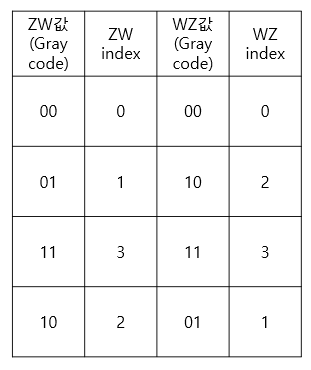
즉 변수 순서 교환 후의 배열은 순환 이동을 고려할 경우 원래 배열의 좌우 반사와 동일한 결과를 가진다. 따라서 열 변수 순서 교환은 카르노맵의 구조를 변화시키지 않으며, $XY/ZW \equiv XY/WZ$가 성립한다.

이상의 결과로부터 행 변수 순서 교환과 열 변수 순서 교환은 모두 카르노맵의 구조를 보존하는 동치 변환임을 알 수 있다.

  

#### 5.5.3 축 교환과 대각선 대칭성

앞 절에서는 행 변수 또는 열 변수 내부의 순서만 변경하는 경우를 분석하였다. 본 절에서는 행 변수와 열 변수의 역할 자체를 서로 교환하는 경우를 다룬다.

**정리 3. 축 교환**

변수 배치가 XY/ZW일 때 행 변수와 열 변수를 서로 교환한 ZW/XY는 원래 카르노맵과 동치이다.

$$XY/ZW \equiv ZW/XY$$

카르노맵의 각 셀 위치를 $(a\text{행}, b\text{열})$로 정의하자. 행 변수와 열 변수를 교환하면 기존의 행 인덱스는 새로운 열 인덱스가 되고, 기존의 열 인덱스는 새로운 행 인덱스가 된다. 따라서 셀의 위치는

$$\left(a,b\right) \rightarrow \left(b,a\right)$$

로 변환된다.

이 변환은 카르노맵 배열에서 행과 열의 역할을 서로 교환하는 전치(transpose)에 해당한다. 이를 확인하기 위하여 4×4 배열에 알파벳을 배치한 예를 살펴보자.

아래 표는 원래 배열과 축 교환 후 배열을 보여준다. 각 원소는 (행, 열) 위치에서 (열, 행) 위치로 이동하므로, 결과적으로 주대각선을 기준으로 한 대칭 배열이 형성된다.

| | 열 1 | 열 2 | 열 3 | 열 4 |
|:---:|:---:|:---:|:---:|:---:|
| **행 1** | A | B | C | D |
| **행 2** | E | F | G | H |
| **행 3** | I | J | K | L |
| **행 4** | M | N | O | P |

표 5.5.8: 원래 4×4 배열 (알파벳 배치)

| | 열 1 | 열 2 | 열 3 | 열 4 |
|:---:|:---:|:---:|:---:|:---:|
| **행 1** | A | E | I | M |
| **행 2** | B | F | J | N |
| **행 3** | C | G | K | O |
| **행 4** | D | H | L | P |

표 5.5.9: 축 교환 후 배열 — 주대각선 기준 전치(transpose)

위 두 표를 비교하면, 축 교환 후 각 원소의 위치가 주대각선(좌상→우하 방향)에 대해 대칭임을 확인할 수 있다.

카르노맵에 그레이코드 인덱스를 적용한 경우도 동일한 원리가 성립한다. 아래 표는 4변수 카르노맵(AB/CD 배치)의 각 셀 인덱스와 축 교환 후 인덱스를 보여준다.

| | CD=00(0) | CD=01(1) | CD=11(3) | CD=10(2) |
|:---:|:---:|:---:|:---:|:---:|
| **AB=00(0)** | (0,0)→0 | (0,1)→1 | (0,3)→3 | (0,2)→2 |
| **AB=01(1)** | (1,0)→4 | (1,1)→5 | (1,3)→7 | (1,2)→6 |
| **AB=11(3)** | (3,0)→12 | (3,1)→13 | (3,3)→15 | (3,2)→14 |
| **AB=10(2)** | (2,0)→8 | (2,1)→9 | (2,3)→11 | (2,2)→10 |

표 5.5.10: AB/CD 배치 카르노맵의 셀 인덱스

축 교환(CD/AB 배치)을 적용하면 행과 열이 교환되어, 기존 열 인덱스가 새로운 행 인덱스가 된다. 따라서 전치 구조가 형성되며, 카르노맵의 본질적인 구조를 변화시키지 않는다. $XY/ZW \equiv ZW/XY$가 성립한다.

한편 축 교환은 앞 절에서 다룬 변수 순서 교환과는 구별되는 독립적인 변환이다. 변수 순서 교환은 동일한 축 내부에서 변수의 순서만 변경하지만, 축 교환은 행 변수 집합과 열 변수 집합 자체를 서로 교환한다는 점에서 구조적으로 다른 의미를 가진다.

#### 5.5.4 동치 변환의 정의

앞 절에서 다음 세 가지 변환이 모두 카르노맵의 구조를 보존함을 확인하였다.

- 행 변수 순서 교환: $XY/ZW \equiv YX/ZW$
- 열 변수 순서 교환: $XY/ZW \equiv XY/WZ$
- 행 변수와 열 변수의 교환: $XY/ZW \equiv ZW/XY$

본 연구에서는 위 세 가지 변환과 전역 순환 이동을 카르노맵의 동치 변환으로 정의한다. 즉 두 변수 배치가 위 변환들의 유한한 조합을 통하여 서로 변환될 수 있다면, 두 배치는 동일한 동치류(equivalence class)에 속한다고 정의한다.

아래 표는 변수 배치 AB/CD에 동치 변환을 적용하여 생성되는 배치들을 보여준다.

| 적용 변환 | 결과 배치 | 원래 배치와의 관계 |
|:---|:---:|:---|
| 원래 배치 | AB/CD | — |
| 행 변수 순서 교환 | BA/CD | AB/CD와 동치 |
| 열 변수 순서 교환 | AB/DC | AB/CD와 동치 |
| 축 교환 | CD/AB | AB/CD와 동치 |
| 행+열 변수 순서 교환 | BA/DC | AB/CD와 동치 |
| 축+행 변수 순서 교환 | CD/BA | AB/CD와 동치 |
| 축+열 변수 순서 교환 | DC/AB | AB/CD와 동치 |
| 축+행+열 변수 순서 교환 | DC/BA | AB/CD와 동치 |

표 5.5.11: AB/CD 배치에서 동치 변환으로 생성되는 배치 목록

이처럼 겉보기에는 서로 다른 변수 배치들이 모두 동일한 카르노맵 구조를 나타내므로 하나의 동치류로 취급할 수 있다.

**[군론적 해석: 정사각형의 대칭군 D₄]** 본 연구에서 사용한 회전 및 반전 변환은 정사각형의 대칭군 $D_4$의 작용으로 해석할 수 있다. 특히 상하반전과 좌우반전의 합성은 180° 회전에 해당하며 대각선 반사와는 서로 다른 변환이다. 따라서 카르노맵의 변수 배치 동치성을 판단할 때 대각선 대칭을 별도의 대칭 연산으로 고려해야 한다. 다만 본 연구의 목적은 군론적 성질 자체를 분석하는 것이 아니라 카르노맵의 구조적 분류를 수행하는 데 있으므로, 이후에는 이러한 변환들을 동치 변환으로만 다루도록 한다.

#### 5.5.5 변수 배치의 동치류 분류

앞 절에서 정의한 동치 변환을 이용하여 4변수 카르노맵의 변수 배치를 분류해 보자.

4개의 변수 A, B, C, D를 카르노맵에 배치하는 경우를 생각하면, 변수의 순서까지 모두 고려한 전체 배치의 수는 $4! = 24$가지이다. 그러나 앞 절에서 보인 바와 같이 변수의 순서 교환($XY/ZW \equiv YX/ZW$, $XY/ZW \equiv XY/WZ$)은 카르노맵의 구조를 변화시키지 않으므로, 변수 배치를 분석할 때는 어떤 변수가 행에 배치되고 어떤 변수가 열에 배치되는지만 고려하면 충분하다.

이 경우 문제는 4개의 변수 중 행에 배치할 두 변수를 선택하는 문제로 바뀐다. 따라서 가능한 변수 분할은

$$\binom{4}{2} = 6$$

가지이며, 아래 표와 같이 나타낼 수 있다.

| 번호 | 행 변수 | 열 변수 | 배치 표기 |
|:---:|:---:|:---:|:---:|
| ① | AB | CD | AB/CD |
| ② | AC | BD | AC/BD |
| ③ | AD | BC | AD/BC |
| ④ | BC | AD | BC/AD |
| ⑤ | BD | AC | BD/AC |
| ⑥ | CD | AB | CD/AB |

표 5.5.12: 4변수 카르노맵의 6가지 변수 분할

그러나 축 교환 변환에 의해 $XY/ZW \equiv ZW/XY$가 성립하므로, 위 여섯 개의 변수 분할은 다음과 같이 서로 대응된다.

| 동치 쌍 | 관계 |
|:---:|:---|
| AB/CD ≡ CD/AB | ① ↔ ⑥ |
| AC/BD ≡ BD/AC | ② ↔ ⑤ |
| AD/BC ≡ BC/AD | ③ ↔ ④ |

표 5.5.13: 축 교환에 의한 변수 분할 대응 관계

결과적으로 여섯 개의 변수 분할은 세 개의 동치류로 축약된다. 즉 4변수 카르노맵에서 고려해야 할 대표 변수 배치는 다음 세 가지뿐이다.

$$AB/CD,\quad AC/BD,\quad AD/BC$$

| 동치류 | 대표 배치 | 포함되는 배치 |
|:---:|:---:|:---|
| 1 | AB/CD | AB/CD, BA/CD, AB/DC, BA/DC, CD/AB, DC/AB, CD/BA, DC/BA |
| 2 | AC/BD | AC/BD, CA/BD, AC/DB, CA/DB, BD/AC, DB/AC, BD/CA, DB/CA |
| 3 | AD/BC | AD/BC, DA/BC, AD/CB, DA/CB, BC/AD, CB/AD, BC/DA, CB/DA |

표 5.5.14: 4변수 카르노맵 변수 배치의 3개 동치류 (각 동치류당 8개 배치 포함)

이는 변수의 이름과 순서에 관계없이 4변수 카르노맵의 구조가 본질적으로 세 가지 형태로 분류될 수 있음을 의미한다. 또한 $4! = 24$가지 배치가 $24 / 8 = 3$개의 동치류로 균등하게 분류된다는 것을 확인할 수 있다.

#### 5.5.6 소결론

본 절에서는 4변수 카르노맵의 변수 배치를 구조적 관점에서 분석하고, 변수 배치의 동치류 개념을 정의하였다.

먼저 카르노맵의 좌표계와 그레이코드 배열 순서를 정의하고, 카르노맵의 상하 및 좌우 경계가 연결되어 있다는 성질을 바탕으로 순환 이동을 구조 보존 변환으로 정의하였다. 이후 행 변수 순서 교환, 열 변수 순서 교환 및 축 교환을 각각 분석하여 다음이 성립함을 보였다.

$$XY/ZW \equiv YX/ZW,\quad XY/ZW \equiv XY/WZ,\quad XY/ZW \equiv ZW/XY$$

이러한 동치 변환을 이용하면 변수 순서를 포함하여 총 24가지 존재하는 4변수 카르노맵의 배치는 구조적으로 중복되는 경우를 제거할 수 있다. 또한 변수의 순서를 무시하고 변수 집합의 분할만 고려하면 가능한 배치는 여섯 가지로 정리되며, 축 교환에 의한 동치 관계를 적용하면 최종적으로 세 개의 대표 배치로 분류된다.

$$AB/CD,\quad AC/BD,\quad AD/BC$$

| 단계 | 배치 수 | 축약 근거 |
|:---|:---:|:---|
| 초기 (변수 순서 포함) | 24 | $4! = 24$ |
| 변수 내 순서 제거 후 | 6 | $\binom{4}{2} = 6$ |
| 축 교환 적용 후 | **3** | 쌍별 동치 ($XY/ZW \equiv ZW/XY$) |

표 5.5.15: 24 → 6 → 3 축약 과정 요약

따라서 이후의 카르노맵 분석에서는 위 세 가지 대표 배치를 기준으로 논의를 전개하며, 동치 변환에 의해 얻어지는 다른 배치들은 동일한 구조를 나타내는 경우로 간주한다. 본 절에서 제시한 동치류 개념은 이후의 패턴 분석 과정에서 반복되는 구조를 효율적으로 정리할 수 있는 이론적 기반이 된다.

### 5.6 변수 재배열 기반 해석 방법

본 연구에서는 변수 재배열(variable rearrangement)을 이용한 카르노맵 패턴 해석 방법을 탐구하였다.

4변수 카르노맵에서 변수 축 배치는 본질적으로 세 가지 독립적인 형태로 분류할 수 있다:

- AB/CD
- AC/BD
- AD/BC

그 외의 배치는 회전(rotation), 상하 반전(reflection), 좌우 반전 등의 시각적 변환을 통해 얻어지는 동일 패턴으로 간주한다. 본 연구에서는 이처럼 회전 및 반전 이후 동일 구조로 해석 가능한 경우를 **구조적 동일성(structural equivalence)**으로 정의한다. 이는 동일한 함수의 카르노맵을 시각적 변환(회전·반전)으로 일치시킬 수 있는 관계, 즉 **시각적 변환 동일성**을 의미하며, 독립적인 축 배치를 세 가지로 한정하는 근거가 된다.

이와 구별되는 개념으로, 서로 다른 독립 축 배치 간에 동일한 패턴이 나타나는 경우는 **변수 교환 대칭성(variable permutation symmetry)**이라 한다. 이는 특정 변수를 교환하더라도 함수의 논리 구조 자체가 유지됨을 의미하며, 시각적 변환에 의한 구조적 동일성과는 본질적으로 다른 속성이다. 독립적인 축 배치는 위 세 가지 경우만을 사용하였다.

예를 들어, 동일한 함수 $F = (A \odot D)(B \odot C)$를 세 가지 독립 축 배치(AB/CD, AC/BD, AD/BC)로 나타내면 아래와 같이 각각의 카르노맵에서 서로 다른 시각적 분포를 보인다. 그러나 인간은 시각적 대칭 구조를 바탕으로 이것이 동일한 함수에 기인한 것임을 직관적으로 판별할 수 있다.

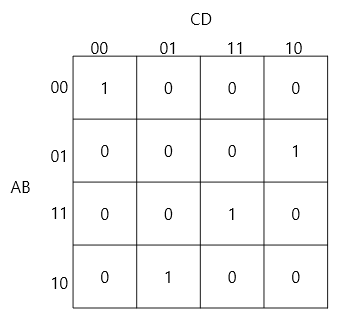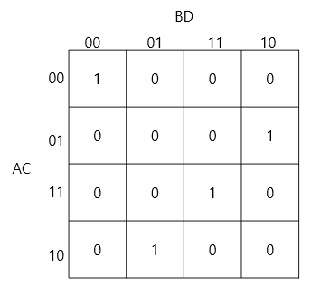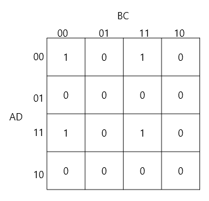

그림 5.6: 동일 함수 F = (A ⊙ D)(B ⊙ C)의 세 가지 축 배치에 따른 시각적 변화

마찬가지로, $F = (A \oplus B)(C \oplus D)$ 역시 축 배치의 변화에 따라 아래와 같은 시각적 패턴의 다변화를 보여준다.

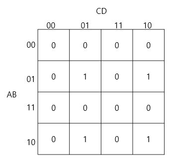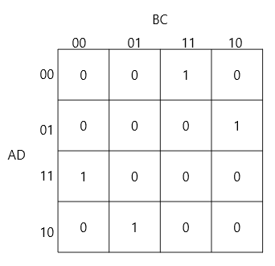

그림 5.7: 동일 함수 F = (A ⊕ B)(C ⊕ D)의 세 가지 축 배치에 따른 시각적 변화

앞서 정의한 변수 교환 대칭성의 구체적 유형은 다음과 같다. AB/CD와 AC/BD 배치에서 동일한 패턴이 나타나는 경우, 변수 B와 C를 교환하더라도 동일한 함수이다. AC/BD와 AD/BC 배치에서 동일 패턴이 나타나는 경우, 변수 C와 D를 교환하더라도 동일한 함수이다. AB/CD와 AD/BC 배치에서 동일한 패턴이 나타나는 경우, 변수 B와 D를 교환하더라도 동일한 함수이다. 특히 세 가지 독립 축 배치 모두에서 동일하거나 유사한 패턴이 유지되는 경우, 변수 B, C, D의 자리를 무작위로 바꾸어도 동일한 함수가 된다.

이러한 변수 재배열 과정은 단순한 축 변경 작업이 아니다. 이는 인간이 동일한 논리 구조를 서로 다른 관점에서 탐색하며 대칭성이나 더 명확한 패턴을 발견하려는 과정, 즉 3장에서 설명한 "구조 재배열을 통한 의미 발견"의 실제 사례이다.

### 5.7 체커보드 패턴과 XOR/XNOR 구조

XOR/XNOR 계열 함수는 일반적인 직사각형 그룹 기반 최소화만으로는 구조를 직관적으로 이해하기 어려운 경우가 존재한다. 이러한 함수는 alternating pattern 형태의 체커보드(checkerboard) 구조를 나타내는 경향이 있다.

**체커보드 패턴(checkerboard pattern)**은 인접 셀 간 출력값이 교대로 반전되는 alternating binary distribution으로 정의한다. 이 패턴은 단순한 인접 그룹 최소화보다 시각적 반복성과 대칭성을 기반으로 이해할 수 있으며, 인간은 이를 XOR/XNOR 구조와 연결하여 직관적으로 해석할 수 있다.

체커보드 패턴의 분류는 다음과 같다:

| 패턴 종류 | 시각적 특징 | 대응 함수 | 적용 축 배치 | 대칭 특성 |
| :--- | :--- | :--- | :--- | :--- |
| **평면체커 (XOR)** | 맵 전체 영역에서 1과 0이 체커판 형태로 완벽히 교대함 | $F = A \oplus B$ (C, D 무관) | AB/CD, AC/BD 등 | 단일 축 패리티 대칭 |
| **라인체커 (XOR)** | 가로축(AB)과 세로축(CD)의 1차원 교대 구간이 만나 교차 영역 형성 | $F = (A \oplus B)(C \oplus D)$ | AB/CD | 이중 축 패리티 대칭 |
| **대각체커 (XOR)** | 라인체커와 논리식은 동일하나 축 변환에 의해 대각 교대로 시각적 강조됨 | $F = (A \oplus B)(C \oplus D)$ | AD/BC | 이중 축 패리티 (대각 방향) |
| **평면 XNOR** | 평면 XOR의 보수 형태로 대각선 상에 1들이 배치됨 | $F = A \odot B$ (C, D 무관) | AB/CD, AC/BD 등 | 단일 축 보수 패리티 대칭 |
| **라인 XNOR** | 행과 열의 변수를 상호 의존적으로 교차 결합하여 교대 라인 형성 | $F = (A \odot D)(B \odot C)$ | AB/CD | 이중 축 보수 패리티 대칭 |
| **대각 XNOR** | 라인 XNOR와 논리식은 동일하나 축 변환에 의해 대각 대칭성이 극대화됨 | $F = (A \odot D)(B \odot C)$ | AD/BC | 이중 축 보수 패리티 (대각 방향) |

#### 5.7.1 XOR 체커보드 패턴 분석

XOR 계열의 체커보드 구조는 시각적으로 인접하지 않은 대각선 형태의 분포를 보인다. 대표적인 세 가지 패턴은 다음과 같다.

- **평면 체커보드 패턴 (Plane Checkerboard)**: 2변수 XOR 특유의 대각선 교대 패턴이 4변수 맵 전체 영역에 반복적으로 나타나는 구조이다 ($F = A \oplus B$).
  

  
그림 5.8: 평면 체커보드 패턴 예시

- **라인 체커보드 패턴 (Line Checkerboard)**: 두 개의 XOR 조건이 동시에 만족될 때만 출력이 1이 되는 구조이다 ($F = (A \oplus B)(C \oplus D)$). 특정 행(AB=01, 10)과 열(CD=01, 10)에서 교대 현상이 발생한다.
  

  
그림 5.9: 라인 체커보드 패턴 예시

- **대각 체커보드 패턴 (Diagonal Checkerboard)**: 라인 체커보드와 본질적으로 동일한 논리식 $F = (A \oplus B)(C \oplus D)$를 표현하지만, 축 배치를 AD/BC로 변환함으로써 시각적으로 대각선 방향의 대칭 흐름이 더 강조된 패턴이다.
  

  
그림 5.10: 대각 체커보드 패턴 예시

#### 5.7.2 XNOR 체커보드 패턴 분석

XOR의 보수 형태인 XNOR 패턴 역시 인접 대각선 패턴을 보이며, 동일 변환에 따른 대응 보수 구조를 가진다.

- **평면 XNOR 패턴**: 입력값이 서로 같을 때 출력이 1이 되며, XOR의 보수 형태의 패턴이 대각선 형태로 나타난다 ($F = A \odot B$). 이 경우 변수 C와 D는 출력에 영향을 미치지 않는 무관 변수(Don't Care)가 된다. 즉, 2변수 XNOR 패턴이 4변수 카르노맵 전체 영역에 반복적으로 복사되어 나타나며, 시각적으로 XOR 평면 체커보드의 정반대 보수 결합 구조를 띤다.
  
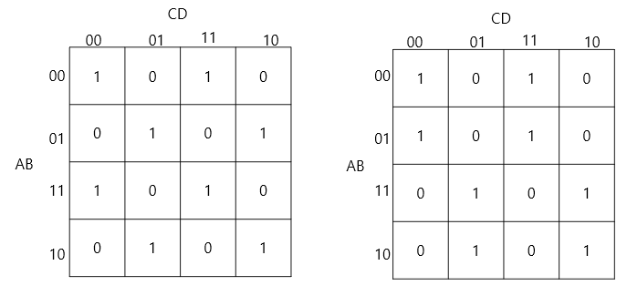
  
그림 5.11: 평면 XNOR 패턴 예시

- **라인 XNOR 패턴**: $A=D$와 $B=C$를 동시에 만족할 때 1이 되는 구조로, $F = (A \odot D)(B \odot C)$로 해석 가능한 교대 패턴이다. 이 함수를 기본 AB/CD 배치로 그리면 $m(0,6,9,15)$의 주대각선 및 반대각선 교점에 분포하는 형태로 나타나지만, AD/BC 배치로 축을 재배열하면 가로와 세로축이 교대로 반복되는 완벽한 라인(수직·수평 교대) 형태로 시각화된다. '라인 XNOR'라는 명칭은 이처럼 AD/BC 배치상에서의 기하학적 시각 특성에서 비롯된 것이다.

  **[변수 쌍 비대칭성의 수학적 원리]**: line XOR는 동일 축 변수끼리 묶어 $(A \oplus B)(C \oplus D)$로 축 대칭을 이루는 반면, line XNOR는 축을 교차하여 $(A \odot D)(B \odot C)$로 결합하는 비대칭성을 보인다. 그 이유는 동일 축끼리 묶은 $(A \odot B)(C \odot D)$의 경우 카르노맵상에서 네 귀퉁이 격자점인 $m(0,3,12,15)$에만 1이 찍히게 되어 기하학적 교대 라인(Line) 흐름을 만들지 못하기 때문이다. 따라서, 가로축과 세로축의 변수들이 대각선 방향으로 상호 연동되어 묶여야만 XNOR 특유의 대각선 교대 패턴이 기하학적으로 성립한다. 이는 부울 대수 공간의 논리 구조가 2차원 카르노맵 평면에 사상될 때 나타나는 고유한 대칭 전이성이다.
  

  
그림 5.12: 라인 XNOR 패턴 예시

- **대각 XNOR 패턴**: 라인 XNOR 패턴과 논리적으로 동일하지만, 축을 AD/BC로 재배치하여 패턴의 형태가 변경된 구조이다. 즉, $F = (A \odot D)(B \odot C)$ 함수를 AD/BC 배치로 나타낸 것으로, 라인 XNOR와 논리식은 완벽히 일치하나 축의 방향에 따른 시각적 패턴 표현이 상이하다. AD/BC 배치에서는 라인(수직·수평 교대) 형태로 시각화되나, 기본 AB/CD 배치에서는 대각선 배열로 표현되어 5.6절에서 서술한 변수 재배열 및 시각적 직관 탐색 과정의 대표적인 실증적 사례가 된다.
  

  
그림 5.13: 대각 XNOR 패턴 예시

#### 5.7.3 3변수 체커보드 패턴 및 무관 변수 패턴

**3변수 체커보드 패턴**
3변수 카르노맵에서 XOR 또는 XNOR 관계가 형성되면, 1이 인접하지 않고 대각선 방향으로 배치되는 체커보드 형태가 나타난다.
- $F = A \oplus B \oplus C = \sum m(1,2,4,7) = \bar{A}\bar{B}C + \bar{A}B\bar{C} + A\bar{B}\bar{C} + ABC$
- $F = A \odot B \odot C = \sum m(0,3,5,6) = \bar{A}\bar{B}\bar{C} + \bar{A}BC + A\bar{B}C + AB\bar{C}$

**입력으로 받지 않는 변수가 포함된 패턴**
3변수 맵에서 변수 C가 무관할 때를 가정해 보자. 만약 $F = A \oplus B$라면, C의 값에 관계없이 A와 B의 조합만으로 결정된다. 이 경우 카르노맵에서는 C=0인 칸과 C=1인 칸이 항상 쌍을 이루어 묶이게 된다. 결과적으로 3변수 맵이지만 실제로는 2변수 맵의 패턴이 수직 또는 수평으로 확장된 직사각형 모양으로 나타난다. 이를 식으로 표현하면 다음과 같다.
- $F = (A \oplus B) \cdot (C + \bar{C}) = (\bar{A}B + A\bar{B})C + (\bar{A}B + A\bar{B})\bar{C} = \bar{A}BC + A\bar{B}C + \bar{A}B\bar{C} + A\bar{B}\bar{C}$
이 식은 카르노맵에서 $m(1,2,5,6)$에 1이 배치되며, 이는 C축 방향으로 두 칸씩 묶인 2개의 덩어리로 나타난다.

### 5.8 대칭성과 함수 불변식

카르노맵 내부의 시각적 대칭성은 함수의 구조적 특성과 긴밀하게 연결된다.

**y=-x 방향 대칭**은 본 연구 범위 내 특정 사례에서 다음 함수 불변식과의 대응 관계가 확인되었다:

> F(A,B,C,D) = F(C,D,A,B)

이는 행 변수 그룹 AB와 열 변수 그룹 CD를 교환하더라도 함수 구조가 유지되는 permutation symmetry를 의미한다. 예를 들어 $m(5,6,9,10)$의 경우 변수 교환 시 6과 9가 서로 교환되고 5와 10은 자기 자신으로 유지되어 대칭성이 나타난다. $m(0,6,9,15)$ 역시 동일하게 6과 9가 교환되며 대칭을 이룬다. 아래는 이러한 y=-x 방향 대칭을 시각적으로 구현한 사례들이다.

그림 5.14: y=-x 방향 대칭을 이루는 카르노맵 예시 (세트 A)

그림 5.15: y=-x 방향 대칭을 이루는 카르노맵 예시 (세트 B)

**y=x 방향 대칭**은 본 연구 범위 내 특정 사례에서 다음과 같은 complement symmetry와의 대응 관계가 확인되었다:

> F(A,B,C,D) = F(C̄,D,Ā,B)

이는 단순 변수 교환뿐 아니라 일부 변수의 보수(complement) 변환이 함께 포함된 형태이다. 예를 들어 $m(1,4,7,11,13,14)$ 함수는 이와 같은 보수 대칭성을 가지며, 아래 카르노맵에서 대각선 대칭 형태로 확인된다.

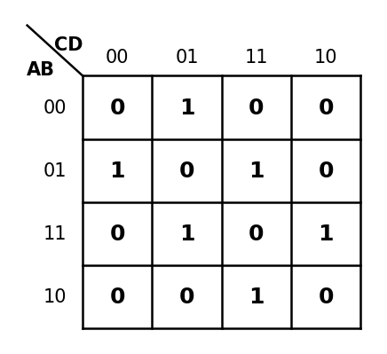

그림 5.16: y=x 방향 보수 대칭(complement symmetry)을 이루는 카르노맵 예시

이러한 결과는 카르노맵 내부의 기하학적 대칭 구조가 단순 시각 효과가 아니라, 함수의 구조적 특징과 직접 연결됨을 보여준다.

변수 재배열 후에도 동일하거나 유사한 패턴이 반복되는 현상은 인간이 카르노맵을 단순한 좌표 정보가 아니라, 시각적 반복성과 대칭성을 가진 **구조 단위**로 이해하고 있음을 보여준다.

### 5.9 이것이 인간 구조적 사고의 사례인 이유

카르노맵 해석 과정에서 인간이 수행하는 것은 다음과 같다:

1. **변수 재배열**: 동일한 논리 함수를 다른 관점에서 바라보며 숨겨진 패턴을 탐색
2. **패턴 인식**: 체커보드 구조, 대칭성을 시각적으로 탐지
3. **구조 이해**: 기하학적 대칭과 함수 불변식의 연결 발견
4. **의미 부여**: "이 패턴은 XOR/XNOR 구조다", "이 대칭은 변수 교환 대칭을 의미한다"

이 과정은 단순 알고리즘 실행이 아니다. 이것은 3장에서 설명한 인간 사고의 핵심 특징, 즉 "구조를 인식하고 재배열하며 의미를 발견하는" 과정의 실증이다.

반면 생성형 AI는 카르노맵을 최소화할 수 있다. 그러나 AI는 패턴의 기하학적 의미를 탐색하거나, 변수 재배열 후 대칭성이 유지된다는 사실로부터 함수 불변식을 추론하는 구조적 통찰을 수행하지 않는다. AI의 처리는 계산이고, 인간의 처리는 구조적 이해이다.

카르노맵의 XOR 패턴은 인간이 시각적 구조를 통해 직접 인식할 수 있는 대표적 사례이다. 반면 생성형 AI는 동일한 구조를 주로 수치적·통계적 패턴으로 처리한다. 이러한 차이는 인간의 구조적 사고와 생성형 AI의 확률적 추론 방식의 차이를 보여주는 교육적 사례가 될 수 있다. 5.5절에서 증명한 동치류 이론은 인간이 수학적 구조를 직관적으로 탐색하고 형식화하는 과정의 실체를 보여주며, 이는 단순한 패턴 재현에 그치는 AI의 처리 방식과 근본적으로 구분된다.

---

## 6장 생성형 AI의 교육 활용과 한계

### 6.1 주요 교육 활용 사례

생성형 AI는 교육 분야에서 다양한 방식으로 활용되고 있다.

**개인 맞춤형 학습**: 생성형 AI는 학습자의 수준과 학습 속도에 맞추어 개인 맞춤형 학습을 제공할 수 있다. 학생이 특정 개념을 이해하지 못할 경우 보다 쉬운 표현이나 추가 예시를 통해 개념을 다시 설명하거나, 높은 수준의 학습자에게는 심화된 내용을 제공할 수 있다.

**프로그래밍 교육**: 학생들은 생성형 AI를 활용하여 코드 작성 방법을 배우거나 오류를 수정할 수 있다. 프로그래밍 초보자가 코드 오류를 해결하지 못할 경우, 생성형 AI는 오류 원인을 분석하고 수정 방향을 제시할 수 있다. 그러나 학습자가 코드의 원리를 충분히 이해하지 못한 채 결과만 사용하는 문제가 발생할 가능성도 존재한다.

**학습 자료 생성**: 교사는 생성형 AI를 활용하여 문제를 제작하거나 수업 자료를 구성할 수 있다. 특정 단원에 대한 객관식 문제, 서술형 문제, 토론 주제 등을 자동으로 생성함으로써 수업 준비 시간을 단축할 수 있다.

### 6.2 교육적 효과

생성형 AI는 학습 효율성과 접근성 향상에 기여한다. 정보 탐색 시간을 감소시켜 학습 집중도를 높이고, 시간과 장소의 제약 없이 활용 가능하다는 점에서 자기주도 학습 환경 형성에 도움을 준다. 또한 대규모 수업 환경에서 교사가 모든 학생의 질문에 반복적으로 대응하기 어려운 문제를 일부 보완할 수 있다.

### 6.3 교육적 한계

**정보 신뢰성 문제**: 생성형 AI는 사실과 다른 내용을 자연스럽게 생성하는 환각 현상을 발생시킬 수 있다. 교육 분야에서는 정보의 정확성과 신뢰성이 매우 중요하기 때문에, 학습자는 AI의 응답을 비판적으로 검토하고 추가적인 자료 검증 과정을 수행해야 한다.

**학습 능력 저하 가능성**: 생성형 AI의 과도한 활용은 학습자의 사고 과정과 문제 해결 능력을 약화시킬 가능성이 있다. 4장에서 분석한 바와 같이, 학생이 어려운 문제를 스스로 고민하는 대신 AI에게 즉시 답을 요청하게 될 경우, 사고 과정 자체가 축소될 수 있다.

특히 교육의 본질은 단순한 정답 획득이 아니라 사고 과정의 성장에 있다는 점에서, 생성형 AI의 무분별한 활용은 교육 목적 자체를 왜곡시킬 위험이 존재한다.

**윤리적 문제**: 표절, 저작권 침해, 개인정보 보호 문제가 발생할 수 있다. 학생이 생성형 AI를 활용하여 과제를 작성할 경우, 스스로 사고하고 탐구하는 과정 없이 결과물만 제출하는 문제가 발생할 수 있다.

**교육 불평등**: 생성형 AI 기술을 효과적으로 활용하기 위해서는 디지털 기기와 인터넷 환경이 필요하며, 일부 고성능 서비스는 유료 기반으로 운영되어 경제적 여건에 따른 교육 격차 문제가 발생할 수 있다.

---

## 7장 생성형 AI 시대의 교육 방향

### 7.1 교육 패러다임의 변화

생성형 AI의 발전에 따라 교육의 방향도 변화해야 한다. 다음 표는 과거 교육과 생성형 AI 시대 교육의 핵심 차이를 정리한 것이다.

| 과거 교육       | 생성형 AI 시대 교육              |
|-----------------|--------------------------------|
| 암기 중심       | 사고 중심                       |
| 정답 생산       | 과정 분석                       |
| 정보 획득       | 정보 검증 + 비판적 평가         |
| 개인 수행       | AI 협업 (도구로서 활용)         |
| 계산 능력       | 비판적 사고 + 메타인지          |
| 결과 중심 채점  | 사고 과정 포함 수행 평가        |

### 7.2 AI 리터러시 교육 강화

생성형 AI 시대에는 AI를 올바르게 이해하고 활용할 수 있는 AI 리터러시(AI Literacy) 교육이 중요해지고 있다. AI 리터러시는 생성형 AI의 작동 원리, 한계, 윤리적 문제를 이해하고 비판적으로 활용할 수 있는 능력을 의미한다.

학생들은 AI의 응답을 그대로 수용하기보다 정보의 신뢰성을 검증하고 비판적으로 분석하는 능력을 길러야 한다. 특히 생성형 AI를 단순한 정답 생성 도구가 아니라 사고와 탐구를 지원하는 보조 도구로 활용하도록 지도하는 것이 중요하다.

### 7.3 인간 중심 교육: 메타인지와 구조적 사고 강화

3장에서 분석한 바와 같이, 인간의 사고는 메타인지와 구조적 이해라는 특징을 가진다. 생성형 AI는 이 능력을 대체할 수 없다.

따라서 미래 교육에서는 다음을 중심으로 인간 중심 역량을 강화해야 한다:

- **비판적 사고력**: AI의 정보를 그대로 받아들이지 않고 분석하는 능력
- **메타인지 강화**: 자신의 학습 과정을 인식하고 조절하는 능력
- **구조적 이해**: 결과가 아닌 구조와 관계를 이해하는 방식의 학습
- **창의성**: 목적 의식 기반의 새로운 아이디어 창출 능력

5장에서 분석한 카르노맵 사례는 이러한 교육의 방향을 잘 보여준다. 변수 재배열, 패턴 탐색, 대칭성 이해를 통해 논리 구조를 직관적으로 이해하는 과정은 단순 계산 학습을 넘어 구조 중심 이해를 가능하게 하는 방법론이다.

### 7.4 교사의 역할 변화와 평가 방식 개선

생성형 AI 시대의 교사는 단순 지식 전달자가 아니라 학습 과정을 설계하고 학생의 사고를 지도하는 역할로 변화할 필요가 있다. 학생들이 생성형 AI를 윤리적이고 비판적으로 활용할 수 있도록 지도하는 것 역시 교사의 중요한 역할이다.

평가 방식 역시 변화가 필요하다. 기존의 결과 중심 평가는 생성형 AI 환경에서 한계를 가지기 때문에, 문제 해결 과정, 사고 과정, 토론 과정 등을 중시하는 수행 중심 평가가 확대될 필요가 있다.

### 7.5 인간 사고 역량별 교육적 대응 방향

4장에서 분석한 인간 사고와 생성형 AI의 구조적 차이는, 생성형 AI에 과도하게 의존하는 학습 환경에서 어떤 역량이 약화될 수 있는지를 구체적으로 시사한다. 아래 표는 각 사고 역량별 위험 요소와 이에 대응하는 교육적 방향을 정리한 것이다.

| 사고 역량 | AI 과의존 시 위험 요소 | 교육적 대응 방향 |
|----------|----------------------|----------------|
| 경험·목적 기반 사고 | 경험 기반 사고 형성 기회 감소 | 체험·탐구 중심 학습 환경 강화 |
| 의미 구성 능력 | 의미 구성 능력 약화 | 비판적 독해·분석 교육 강화 |
| 비판적 검토 능력 | 비판적 검토 습관 형성 기회 감소 | AI 응답 검증 훈련 및 다중 자료 비교 습관화 |
| 메타인지 | 메타인지 형성 기회 감소 | 자기 주도적 오류 수정 과정 중심 수업 설계 |
| 창의성 | 목적 의식 기반 창조력 약화 | 문제 발견·정의 단계를 포함한 프로젝트 학습 |
| 오류 인식 능력 | 자기 수정 역량 형성 기회 감소 | 풀이 과정 공유 및 동료 피드백 중심 평가 확대 |

---

## 8장 결론

### 8.1 연구 내용 요약

본 연구는 생성형 AI의 언어 생성 구조와 인간 사고 과정의 특징을 비교·분석하고, 카르노맵의 시각적 패턴 해석을 실증 사례로 제시하여 인간 구조적 사고의 교육적 의미를 탐구하였다.

2장에서는 생성형 AI가 LLM을 기반으로 확률적으로 문장을 생성하는 구조를 분석하였으며, 이 구조가 실제 의미 이해와는 다름을 확인하였다.

3장에서는 인간 사고의 특징으로 의미 이해, 메타인지, 목적 의식 기반 창의성을 제시하였다. 특히 메타인지는 자기 인식, 자기 수정, 자기 반성의 능력을 포함하며, 생성형 AI가 가지지 않는 핵심 특징임을 확인하였다.

4장에서는 두 구조의 차이를 비교표와 사례를 통해 분석하였으며, 존 설의 중국어 방 논증을 통해 언어 생성 능력이 의미 이해 능력과 동일하지 않음을 논하였다.

5장에서는 카르노맵의 변수 재배열, 체커보드 패턴 인식, 대칭성과 함수 불변식 탐색 과정이 인간의 "구조를 인식하고 재배열하며 의미를 발견하는" 사고 방식의 실증 사례임을 보였다. 특히 5.5절에서는 4변수 카르노맵의 변수 배치를 동치 변환(행 변수 순서 교환, 열 변수 순서 교환, 축 교환)으로 분류하여, 총 24가지 배치가 구조적으로 3개의 대표 배치(AB/CD, AC/BD, AD/BC)로 축약됨을 수학적으로 증명하였다. 이 증명 과정 자체가 인간이 수학적 구조를 직관적으로 탐색하고 형식화하는 능력의 실체를 보여준다.

6~7장에서는 생성형 AI의 교육적 활용과 한계, 그리고 미래 교육의 방향을 제안하였다.

### 8.2 최종 결론

생성형 AI는 언어 패턴을 확률적으로 생성하지만, 인간은 구조를 인식하고 재배열하며 의미를 발견하는 방식으로 사고한다. 이 차이는 단순한 기술적 차이가 아니라, 교육에서 사고 과정이 왜 대체 불가능한 가치를 가지는지를 설명한다.

카르노맵의 시각적 패턴 해석은 이 주장의 살아있는 사례이다. 변수 재배열을 통해 숨겨진 패턴을 탐색하고, 기하학적 대칭과 함수 불변식을 연결하는 과정은 알고리즘이 아닌 인간 고유의 구조적 사고 방식을 보여준다.

특히 카르노맵 사례가 인간 구조적 사고의 대표적 실증이 될 수 있는 이유는, 이 과정이 단순한 계산 문제가 아니라 구조적 사고의 핵심 요소를 모두 포함하는 축소 모델이기 때문이다. 인간은 동일한 함수를 여러 관점에서 재표현하고(변수 재배열), 그 과정에서 패턴을 재구성하며(체커보드 인식), 대칭성을 발견하고(함수 불변식 추론), 최종적으로 그 구조에 의미를 부여한다(XOR/XNOR 해석). 이러한 다층적 인지 과정은 생성형 AI의 확률적 패턴 재현과 본질적으로 구분되며, 인간만이 수행할 수 있는 구조적 이해의 실체를 보여준다.

따라서 생성형 AI 시대의 교육은 AI와 경쟁하는 방향이 아니라, 인간만의 구조적 사고 능력과 메타인지를 강화하는 방향으로 발전해야 한다. 생성형 AI는 강력한 보조 도구가 될 수 있지만, 사고 과정을 생략한 결과 중심 학습이 강화될 경우 인간 사고의 핵심 역량이 약화될 위험이 존재한다.

결국 생성형 AI 시대의 핵심 과제는 AI를 효과적으로 활용하면서도, 인간의 사고 과정과 의미 이해 능력을 유지하는 균형점을 찾는 것이다.

### 8.3 연구 한계 및 향후 과제

본 연구는 문헌 조사와 사례 분석 중심으로 수행되었으며, 실증적 실험 연구는 포함되지 않았다. 향후 연구에서는 생성형 AI 활용이 학습자의 사고력과 메타인지에 실제로 어떤 영향을 미치는지에 대한 실증 연구가 필요하다.

카르노맵 연구의 경우, 4변수 중심의 분석을 5변수 이상으로 확장하고, 자동 패턴 탐지 알고리즘 연구와 AI 기반 카르노맵 구조 해석으로 발전시킬 가능성이 존재한다. 특히 5.5절에서 구축한 D₄ 군론 기반 동치류 이론은 5변수 이상의 다차원 카르노맵에서도 적용 가능한 일반화된 대칭 분류 체계로 확장될 수 있으며, 이는 향후 군론(S₄, D₄)을 이용한 대칭성 해석 연구의 출발점이 될 수 있다. 나아가 본 연구에서 탐구한 인간의 시각적 패턴 인식 과정은 인지과학(Visual Cognition) 및 패턴 인식(Pattern Recognition) 연구와 연계될 수 있으며, 설명 가능한 AI(Explainable AI) 및 인간-AI 협업(Human-AI Collaboration) 연구에도 기초적 시사점을 제공할 수 있을 것으로 기대된다.

---

## 참고문헌

1. Karnaugh, M. (1953). "The Map Method for Synthesis of Combinational Logic Circuits." *Transactions of AIEE, Part I: Communication and Electronics*, 72(9), 593–599.
2. Shannon, C. E. (1938). "A Symbolic Analysis of Relay and Switching Circuits." *Transactions of AIEE*, 57(12), 713–723.
3. Mano, M. M., & Ciletti, M. D. (2013). *Digital Design: With an Introduction to the Verilog HDL*. 5th ed., Pearson.
4. Searle, J. R. (1980). "Minds, brains, and programs." *Behavioral and Brain Sciences*, 3(3), 417–424.
5. Flavell, J. H. (1979). "Metacognition and cognitive monitoring: A new area of cognitive-developmental inquiry." *American Psychologist*, 34(10), 906–911.
6. Vaswani, A., et al. (2017). "Attention is All You Need." *Advances in Neural Information Processing Systems*, 30.
7. OpenAI. (2023). *GPT-4 Technical Report*. OpenAI.
8. Gray, F. (1953). "Pulse code communication." U.S. Patent No. 2,632,058. Washington, DC: U.S. Patent and Trademark Office.
9. Wakerly, J. F. (2006). *Digital Design: Principles and Practices*. 4th ed., Upper Saddle River, NJ: Pearson Prentice Hall.
